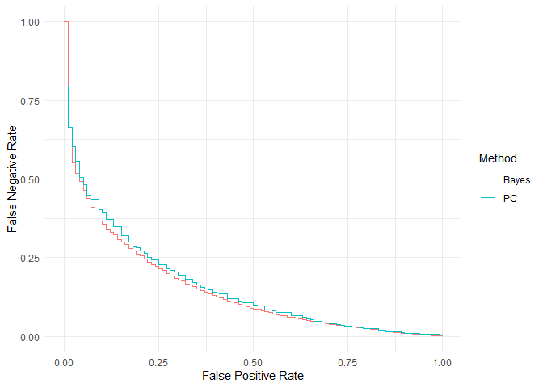

<!-- README.md is generated from README.Rmd. Please edit that file -->

# fahb

<!-- badges: start -->

[](https://github.com/DTWilson/fahb/actions/workflows/R-CMD-check.yaml)
<!-- badges: end -->

The goal of `fahb` is to help with feasibility assessment via
hierarchical Bayesian recruitment models, fitted to (internal or
external) pilot date. It can be used at the design stage to optimise the
pilot and any pre-specified decision rules to guide progression, and at
the analysis stage to produce a probabilistic prediction of the time
until the main trial recruits to target.

## Installation

Install the released version of `fahb` from CRAN:

``` r
install.packages("fahb")
```

Or you can install the development version of `fahb` from
[GitHub](https://github.com/) with:

``` r
# install.packages("devtools")
devtools::install_github("DTWilson/fahb")
```

## Example

Suppose we are planning an internal pilot for a trial which aims to
recruit `N = 320` participants from `m = 20` sites, and that we expect
recruitment to complete in three years. The pilot analysis will happen
at 12 months (so at time `t = 1/3` relative to the expected recruitment
time), and we would class the trial as infeasible if recruitment took
longer than `rel_thr = 1.2` times the expected recruitment time.

The variables `N, m, t` and `rel_thr` define the design variables. For
the model parameters, for the purpose of illustration we use the package
defaults (but see the vignette and the associated paper for more
discussion of these). To use `fahb` we first encode all design variables
and model parameters in a `fahb_problem` object, then run some
simulations via `forecast()` before finding possible decision rules and
the operating characteristics they lead to:

``` r
library(fahb)

problem <- fahb_problem(N = 320, m = 20 , t = 0.2, rel_thr = 1.2)

# Run the simulations
problem <- forecast(problem)

# Find some candidate decision rules are their OCs
design <- fahb_design(problem)
#> Searching for efficient progression criteria...
#> Approximating Bayesian operating characteristics...

print(design)
#> Standard progression criteria
#> 
#>     FPR         FNR        n_p        m_p        r_p
#> 1   0.0 0.796003912 25.4242082  1.3232325  8.1958645
#> 11  0.1 0.393600671 12.9467906 -0.9914697  6.3969204
#> 21  0.2 0.271482465  9.4408576  1.4705756  6.0445189
#> 41  0.4 0.137487774  2.7714409 -0.7881610  5.5044016
#> 51  0.5 0.098504960 -0.1603635  0.3890277  5.0824694
#> 71  0.7 0.040240324  0.5494002  0.5706203  3.9297857
#> 81  0.8 0.023333799 -0.3250727 -0.4445800  3.3495451
#> 91  0.9 0.009501188 -0.4354369  0.9006933  2.2724682
#> 101 1.0 0.000000000 -0.6782580 -0.3317336 -0.7786454
#> 
#> Bayesian approximation
#> 
#>     FPR         FNR      T_p
#> 1   0.0 1.000000000 1.170344
#> 11  0.1 0.355595920 3.202008
#> 21  0.2 0.256112896 3.371313
#> 41  0.4 0.125052396 3.674652
#> 51  0.5 0.086209306 3.798104
#> 71  0.7 0.037306134 4.023844
#> 81  0.8 0.024311863 4.140242
#> 91  0.9 0.009501188 4.302493
#> 101 1.0 0.000000000 4.676375
#> 
#> FPR - False Positive Rate
#> FNR - False Negative Rate
#> 
#> n_p, m_p, r_p - Probabilistic thresholds for standard
#>                 progression criteria on the number recruited,
#>                 number of sites opened, and the recruitment rate
#>                 (participants per site per year) respectively
#> 
#> T_p - Bayesian decision rule threshold for the posterior predictive
#>       expected time until full recruitment
plot(design)
```



Two types of decision rules are considered here. Firstly, we consider
rules which take the same form as the standard progression criteria
suggested by the NIHR. In the table output, `n_p` is a minimum number of
participants recruited, `m_p` is a minimum number of sites opened, and
`r_p` is a minimum rate of recruitment (participants per site-year), and
we progress to the main trial only if all of these thresholds are met.

The second type of decision rules is defined by `T_p`, the maximum
expected time until full recruitment conditional on the pilot data. We
progress to the main trial only if the actual posterior predictive
expectation is lower than this threshold.

Decision rules of both types are characterised by their false positive
(`FPR`) and false negative (`FNR`) rates. These are estimated via
simulation by comparing the decisions made with the underlying
feasibility, as determined by the threshold `rel_thr`. For example, we
can attain `FPR = 0.15` and `FNR = 0.34` if we proceed only if we
recruit at least $10.48$ participants from at least $1$ site, with an
overall rate of at least $6.57$ participants per site-year. We can get
slightly better operating characteristics if we use a Bayesian
progression rules instead. If we want to improve the pilot further we
can increase the design variable `t` so that the internal pilot will
have more data.
